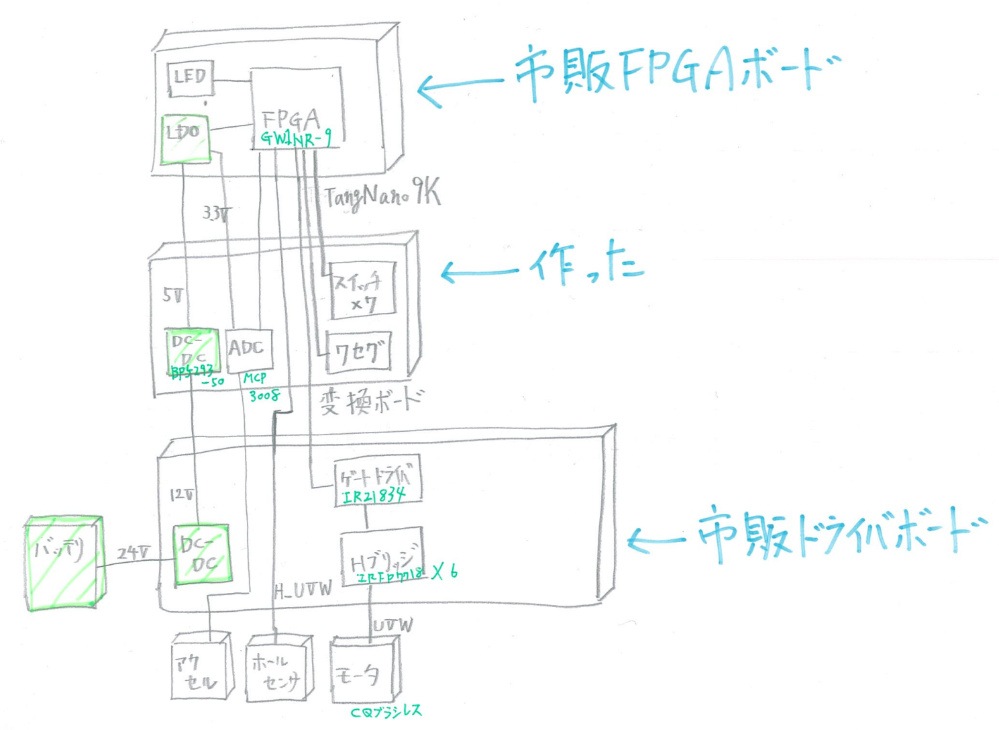

# Overview
 This PCB board was made as a conversion board for Inverter Kit2 that is selling by CQ pub.
 Using this board, you can attach Tang Nano 9K(Sipeed) as an alternative to NUCLEO.
 There's Garber data made by KiCAD.

# BoM
型名 | アイテム（Item）|個数（Quantity）
---|---|---
　| 1608チップコンデンサ1μF | 1
　| 1608チップ抵抗220Ω | 8
　| ダブルピンヘッダ（2x19列） | 2
TVGP01-G73BB with Gray cap | スイッチ | 4
MCP3008-I/P | A-Dコンバータ | 1
2MS1-T1-B4-M2-Q-E | トグルスイッチ | 3
OSL40562-LR | 4桁8セグLED | 1
BP5293-50 | 5VDCDCコンバータ | 1

# FPGA Design
There's a sample project in sample directory.  
The project is files for Gowin EDA which is IDE for Gowin FPGA.
You can download Gowin EDA without any cost.
